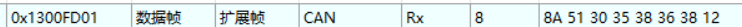
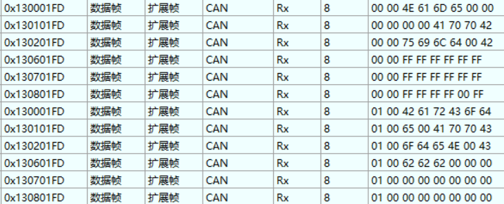
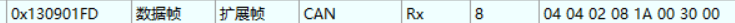
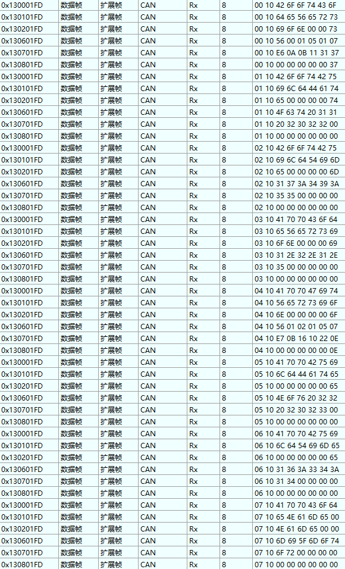
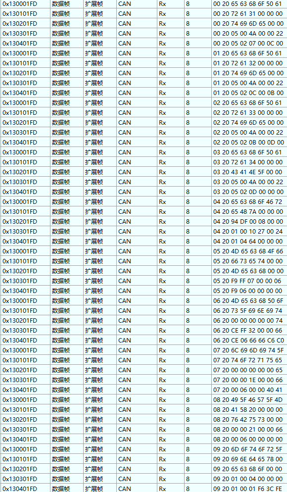
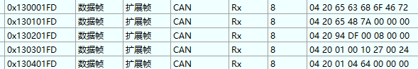
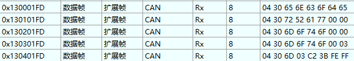

# 小米关节电机上位机：参数表加载报文解析

## 命令解析

上位机要求加载参数表

从机开始加载参数表

结束加载参数表 1309

## 1.字符串变量

字符串变量 功能码 0x0000 -0x1000

### 1.1 参数表前两个变量

回复CANID用 1300 1301 1302 1306 1307 1308 ，Data前两位是功能码
其中1300 1301 1302用来存放变量名的ASCII码，依次向后填充，填充结束以00结尾，提示上位机填充完毕。
其中1306 1307 1308用来存放字符串值的ASCII码，依次向后填充，填充结束以00结尾，提示上位机填充完毕。

特殊：有些命令下一帧的相同位置总是和上一帧一致，推测可能是用同一个数组传输数据但是有些位没使用所以没有更新数据。

难以解析：在传输完成后有空余位，仍传输一些ASCII码，不知代表什么意思。

### 1.2 参数表其它字符串变量

和字符串变量保持一致，难以解析的点也是。

## 2.可读写变量

可读性变量 回复CANID用 1300 1301 1302 1303 1304 

其中1300 1301 1302用来存放变量名的ASCII码，依次向后填充，填充结束以00结尾，提示上位机填充完毕。
其中1303 1304 用来存放变量最大值，最小值，变量类型，变量值，依次向后填充，填充结束以00结尾，提示上位机填充完毕。

解析2004变量

04 20 65 63 68 6F 46 72 
04 20 65 48 7A 00 00 00 解释：65 63 68 6F 46 72 65 48 7A 00 00 00两帧共同构成功能码的ASCII码，空位用00补充。
04 20 94 DF 00 08 00 00 解释：94 DF 00 08 00 不知何解，最后一位与上一帧结尾保持一致
04 20 01 00 10 27 00 24 解释：01 00最小值；10 27最大值；00代表最小值和最大值同时乘以10的次方系数，达到扩大最小值最大值的目的；24不知何解
04 20 01 04 64 00 00 00 解释：01同上一帧保持一致；04 代表变量类型Uint 32；64 00 00 00 代表数据

## 3.只读写变量

04 30 65 6E 63 6F 64 65 
04 30 72 52 61 77 00 00 解释：同上
04 30 6D 6F 74 6F 00 00 解释：不知何解
04 30 6D 6F 74 6F 00 03 解释：不知何解
04 30 6D 03 C2 3B FE FF 解释：03 类型；C2 3B 值；FE FF不知何解

