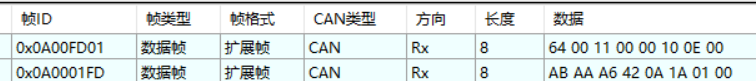
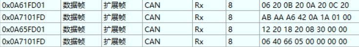
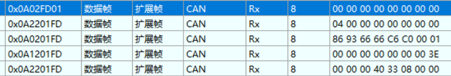
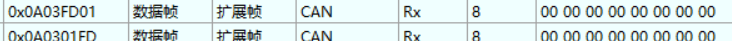

# 小米示波器功能分析

上位机显示开始采集后

## 设置采样频率


无论几个变量都是如此


## 设置通道

7个变量



## 数据反馈


## 停止采集




# CAN 示波器（Scope）数据采集功能说明

## 1. 功能概述

本功能用于通过上位机下发 CAN 指令，配置从机（电机控制板）需要采集的变量列表与采样频率，并在“开始采集”后按指定频率将变量数据周期性发送至 CAN 总线。

为便于上位机绘图，采样数据的**第一帧**携带一个 **16-bit 时间戳**（来自系统 Tick 的低 16 位），时间戳范围 `0x0000 ~ 0xFFFF` 循环递增。

- 最大可采集变量数：**8 个**
- 采样频率范围：`1 ~ 1000 Hz`（受 1kHz 调度限制）
- 多变量时每次采样可能产生 **多帧 CAN 数据**（第一帧有时间戳，后续帧无时间戳）

------

## 2. CAN 扩展帧 ID 结构（29-bit）

使用 **扩展帧（Extended ID）** 进行通信，ID 按如下位域编码：

- `bit0 ~ 7`：`target_id`（目标设备 ID）
- `bit8 ~ 23`：`data2`（16-bit 扩展字段）
- `bit24 ~ 28`：`comm_type`（5-bit 指令类型）

即扩展ID逻辑结构为：

```
[ comm_type(5bit) ] [ data2(16bit) ] [ target_id(8bit) ]
```

在 Scope 功能中：

- `comm_type = 0x0A` 表示进入示波器/采集功能
- `data2` 的 **高字节**为 `subcmd`
- `data2` 的 **低字节**通常为主机 ID（例如 `0xFD`），本功能实现中**不依赖该字段**

例：`0x0A00FD01`

- `0x0A`：Scope 功能
- `0x00`：subcmd=设置带宽（采样频率）
- `0xFD`：主机 ID（不参与逻辑判断）
- `0x01`：目标从机 ID

------

## 3. Scope 指令定义（subcmd 规则）

Scope 功能由 `comm_type = 0x0A` 触发，具体动作由 `subcmd = (data2 >> 8) & 0xFF` 决定。
按照小米上位机开启示波器功能发送指令顺序依次介绍：

### 3.1 设置采样频率（带宽）

- **subcmd = 0x00**
- Data：携带采样频率（Hz）
- 频率范围：`1 ~ 1000 Hz`
  - 大于 1000 按 1000 处理
  - 小于 1 按 1 处理

**小米指令示例**：设置采样频率为100HZ
上位机指令示例：CAN ID：`0x0A00FD01`  Data:`64 00 11 00 00 10 0E 00`
设备回复示例：CAN ID：`0x0A0001FD`  Data:`AB AA A6 42 0A 1A 01 00`

设备识别指令为设置采样频率，只会解析Data前两位 `64 00`，后续不解析，然后设置采样频率，按上述回复指令，回复数据参考小米上位机，但不知道数据代表含义。

> 说明：采样调度由 1kHz Hook 驱动，因此最高只能支持 1kHz。

### 3.2 设置变量 ID 列表（最多 8 个变量）

变量设置使用 subcmd 的“总数 + 起始序号”编码：

- `subcmd = (N-1)<<4 | start`
- `N`：本次采集的变量总数（1~8）
- `start`：本帧承载的起始变量序号（**1-based**），通常为 `1` 或 `5`

举例：

- 采集 1 个变量：`subcmd = 0x01`（N=1, start=1）
- 采集 3 个变量：`subcmd = 0x21`（N=3, start=1）
- 采集 4 个变量：`subcmd = 0x31`（N=4, start=1）
- 采集 5 个变量：两帧
  - 第一帧：`subcmd = 0x41`（N=5, start=1）携带 var1~var4
  - 第二帧：`subcmd = 0x45`（N=5, start=5）携带 var5
- 采集 8 个变量：两帧
  - 第一帧：`subcmd = 0x71`（N=8, start=1）携带 var1~var4
  - 第二帧：`subcmd = 0x75`（N=8, start=5）携带 var5~var8

#### 变量 ID 在 Data 中的格式

- 每帧 Data 最多携带 **4 个变量 ID**，所以当采集超过四个变量时，就需要使用两帧数据承载**变量ID**。
- 每个变量 ID 为 `uint16`，**小端序**
- Data 布局（例：4个ID）：

```
Byte0-1  : id[start+0]
Byte2-3  : id[start+1]
Byte4-5  : id[start+2]
Byte6-7  : id[start+3]
```

若某帧只包含少于 4 个变量 ID，剩余位置可填 `0x0000`（实现中遇到0可停止继续填充）。

**小米指令示例**：采集6个变量，变量ID为：2001 2002 2003 2004 2005 2006
上位机指令示例：CAN ID：`0x0A51FD01`  Data:`01 20 02 20 03 20 04 20`
设备回复示例：CAN ID：`0x0A6101FD`  Data:`AB AA A6 42 0A 1A 01 00`
上位机指令示例：CAN ID：`0x0A55FD01`  Data:`05 20 06 20 00 00 00 00`
设备回复示例：CAN ID：`0x0A6501FD`  Data:`66 60 64 22 00 00 00 00`

设置采集变量的指令关于上位机这部分比较清晰，设备回复只有data部分不知道，故默认回复全0.

> 变量在内部的存储顺序应严格按上位机设置的顺序（var1..varN）保存。


### 3.3 开始采集

- **subcmd = 0x02**
- 从机进入采集运行态，开始按采样频率周期发送数据
  
**小米指令示例**：
上位机指令示例：CAN ID：`0x0A02FD01`  Data:`00 00 00 00 00 00 00 00`
设备回复示例：CAN ID：`0x0A0201FD`  Data:`00 00 00 00 00 00 00 00`

### 3.4 停止采集

- **subcmd = 0x03**
- 从机停止发送采集数据

**小米指令示例**：
上位机指令示例：CAN ID：`0x0A03FD01`  Data:`00 00 00 00 00 00 00 00`
设备回复示例：CAN ID：`0x0A0301FD`  Data:`00 00 00 00 00 00 00 00`

------

## 4. 采样调度与频率实现

### 4.1 调度来源

采样逻辑放在：

- `MC_APP_LowFrequencyHook_M1()`（频率 1kHz）

每 1ms 调用一次：

```
CAN_Scope_Tick1kHz();
```

### 4.2 支持任意 1~1000Hz

采用“计数/相位累积”分频，保证：

- `f_hz` 能整除 1000 时：严格按整分频触发采样
- `f_hz` 不能整除 1000 时：通过误差累积实现平均频率准确，避免长期漂移

------

## 5. 时间戳定义（16-bit）

### 5.1 时间戳语义

时间戳与“真实时间”相关，不依赖采样事件计数。

- `timestamp = (uint16_t)(SystemTick & 0xFFFF)`
- SystemTick 通常来自 `HAL_GetTick()`（1ms）

时间戳范围 `0x0000~0xFFFF`，溢出后回到 `0x0000` 周期循环。

### 5.2 时间戳放置规则

- **每次采样周期的第一帧**携带时间戳（2字节）
- 同一采样周期的后续续帧（如果变量拆帧）**不携带时间戳**

------

## 6. 采样数据上报格式（CAN Data）

### 6.1 分帧规则

每个采样周期要发送的变量数据按“上位机设置变量的顺序”连续打包。

- **第一帧**：
  - Byte0~1：`timestamp(uint16, little-endian)`
  - Byte2~7：变量数据（最多 6 字节）
- **续帧（第二帧起）**：
  - Byte0~7：变量数据（8 字节）

变量数据支持**跨帧切割**。例如三个4字节变量，值分别是0x 11 12 13 14；0x 21 22 23 24；0x 31 32 33 34；时间戳是 0x CE 98
设备回复指令为：第一帧CAN ID：`0x0A02FD01`  Data:`CE 98 11 12 13 14 21 22`
                第二帧CAN ID：`0x0A02FD01`  Data:`23 24 31 32 33 34 00 00`
### 6.2 变量类型与长度（采样范围）

本功能仅支持数值类型，不支持 string。

| 类型           | 长度   |
| -------------- | ------ |
| uint8 / int8   | 1 字节 |
| uint16 / int16 | 2 字节 |
| uint32 / int32 | 4 字节 |
| float32        | 4 字节 |

> 变量的“ID -> 类型/长度”由 **ID 描述表**提供。

------

## 7. ID 描述表（必要组件）

系统应维护一张 descriptor 表，用于将变量 ID 映射到类型/字节长度（本功能实现依赖它进行打包）。

每项至少包含：

- `uint16 id`
- `VarType type`（u8/i8/u16/i16/u32/i32/f32）
- `uint8 size`（1/2/4）

> 上位机配置的是 ID 序列，从机按 descriptor 决定每个变量需要占用的字节数，并按顺序打包上报。

------

## 8. 变量值绑定接口（由业务侧实现）

从机采样时需要根据 ID 读取变量当前值并拷贝为原始字节流。

建议提供统一接口（示例）：

```
// size 只会是 1/2/4
bool Scope_ReadVarBytes(uint16_t id, uint8_t *out, uint8_t size);
```

- 返回 true：读取成功
- 返回 false：未绑定/读取失败（可选择填0）

业务侧只需在 `switch(id)` 中绑定对应变量，并按 size 拷贝即可。

------

## 9. 发送频率说明（多变量导致“总线频率变高”）

采样频率由上位机设置为 `f_hz`，但每次采样可能产生 `K` 帧数据，因此：

- **采样事件频率**：`f_hz`
- **CAN 上报帧频率（scope 数据帧）**：约等于 `f_hz * K`

例如：

- 采样频率 100Hz
- 变量较多拆成 2 帧
- 则 CAN 上报帧频率约 200fps

------


